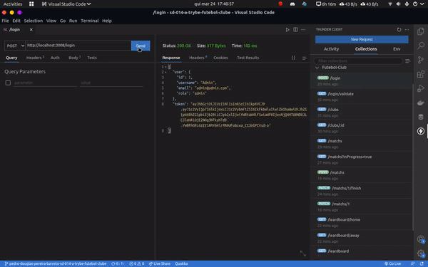
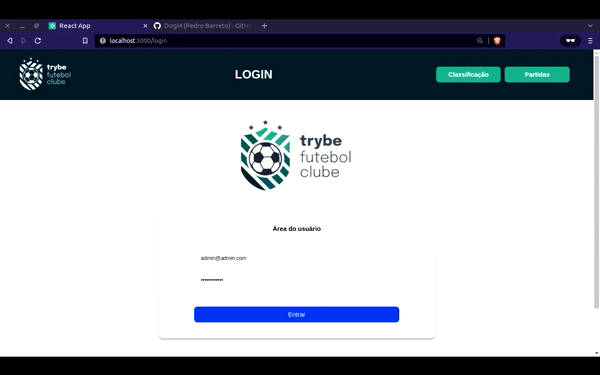

# Trybe-Futebol-Clube | SiteFullStack

## 📷 Screenshot
 

    
    
  

## 📋 Descrição do projeto
Um site de gerenciamento e acompanhamento das partidas de futebol. Com a versão de usuário e administrador. Uma aplicação full-stack, que vai deste a criação e gerenciamento de uma API, ligada ao banco de dados, até a parte final para o usuário.

## 💻 Tecnologias utilizadas
- NodeJS/ TypeScript /JavaScript
- Express/JWT
-  MySQL/Sequelize(ORM)
- Docker (Servidores rodam via Container)
- Mocha/Chai/Sinon (Testes de integração)

## :balloon: Endpoints
- POST - `/login`
- GET - `/login/validade`
- GET - `/clubs`
- GET - `/clubs/:id`
- GET - `/matchs`
- GET - `/matchs?inProgress=true`
- POST - `/matchs`
- PATCH - `/matchs/:id/finish`
- PATCH - `/matchs/:id`
- GET - `/leardboard/home`
- GET - `/leaderboard/away`
- GET - `/leaderboard`

## 📈 Status do projeto
✅ Concluído

<!-- ## 🚀 Links 
- Design do projeto no Figma: 
- Site em produção: -->

## :busts_in_silhouette: Colaboradores

Estas pessoas participaram deste projeto:

<table>
  <tr  style="width:120px">
    <td align="center">
      <a target=”_blank” href="https://github.com/Dogl4">
         
        
          <b>Pedro Barreto</b>
        
      </a>
    </td>
    <td align="center">
      <a target=”_blank” href="https://github.com/betrybe">
         
        
          <b>Trybe</b>
        
      </a>
    </td>
  </tr>
  <td width="120px;">
    Desenvolvimento do back-end.
  </td>
  <td width="120px;">
    Desenvolvimento do front-end.
  </td>
  </th>
</table>
